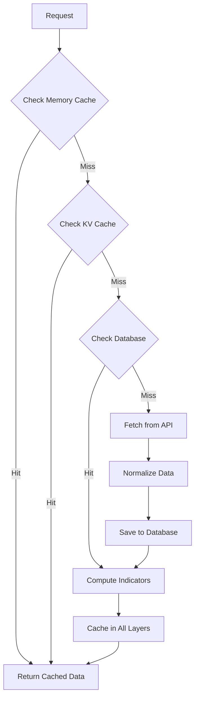
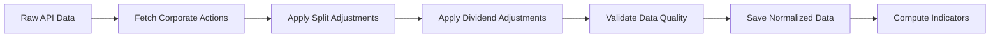

# Enhanced Caching and Database Layer Implementation

## Overview

This document provides a comprehensive guide to the enhanced caching and database layer implementation for the AI Stock Picker application. The upgrade transforms the system from in-memory caching to a persistent, scalable database solution using Cloudflare D1 with SQLite for development.

## 🚀 Quick Start

### Development Setup

1. **Install dependencies**
   ```bash
   npm install
   ```

2. **Set up environment variables**
   ```bash
   cp .env.example .env
   # Edit .env with your API keys
   ```

3. **Run database migrations**
   ```bash
   npm run migrate
   ```

4. **Start development server**
   ```bash
   npm run dev
   ```

### Production Deployment

1. **Create D1 database**
   ```bash
   wrangler d1 create ai-stock-picker-db
   ```

2. **Update wrangler.toml** with your database ID

3. **Deploy**
   ```bash
   wrangler deploy
   ```

## 📊 Architecture

### Database Schema

The enhanced system uses 6 core tables:

- **stocks**: Master stock information
- **ohlcv_data**: Historical price data with normalization
- **fundamentals**: Company financial metrics
- **indicators**: Computed technical indicators
- **currency_rates**: FX conversion rates with TTL
- **cache_metadata**: Cache management and TTL tracking

### Caching Strategy

Three-layer caching system:

1. **Memory Cache** (Fastest): 15min-6hr TTL
2. **Cloudflare KV** (Distributed): 15min TTL
3. **Database Cache** (Persistent): Configurable TTL

### TTL Configuration

- **OHLCV Data**: 15 minutes
- **Technical Indicators**: 1 hour
- **Fundamentals**: 6 hours
- **Currency Rates**: 1 hour
- **Stock Metadata**: 24 hours

## 🔧 API Endpoints

### Enhanced Endpoints

- **`GET /api/analyze/:symbol`** - Now uses database with intelligent caching
- **`GET /health/database`** - Database health and performance metrics
- **`GET /metrics/cache`** - Cache hit rates and system performance
- **`GET /metrics/performance`** - Response times and data freshness
- **`GET /api/currency/convert`** - Currency conversion with caching

### New Monitoring Endpoints

- **`/health/database`** - Comprehensive database health check
- **`/metrics/cache`** - Cache performance statistics
- **`/metrics/performance`** - System performance metrics

## 📁 File Structure

```
lib/
├── database/
│   ├── DatabaseInterface.js    # Abstract interface
│   ├── D1Database.js          # Cloudflare D1 implementation
│   ├── SQLiteDatabase.js      # SQLite implementation
│   └── DatabaseService.js     # Service factory
├── cache/
│   └── CacheManager.js        # Multi-layer cache manager
├── data/
│   ├── CurrencyService.js     # FX conversion service
│   └── DataNormalizer.js      # Data normalization pipeline
scripts/
└── migrate.js                 # Database migration script
```

## 🔄 Data Flow

### Analysis Request Flow



### Data Normalization Pipeline



## 🎯 Performance Features

### Intelligent Caching

- **LRU Eviction**: Automatic cleanup of least recently used entries
- **TTL Management**: Automatic expiration based on data type
- **Multi-layer Fallback**: Graceful degradation across cache layers
- **Hit Rate Optimization**: Target >90% cache hit rate

### Database Optimization

- **Indexing**: 7 performance indexes for common queries
- **Connection Pooling**: Efficient database connection management
- **Batch Operations**: Optimized bulk data operations
- **Query Optimization**: Prepared statements and parameterized queries

### Data Quality Assurance

- **Validation Pipeline**: Automatic data quality checks
- **Anomaly Detection**: Statistical outlier detection
- **Completeness Monitoring**: Track missing data points
- **Accuracy Verification**: Price relationship validation

## 🛠️ Configuration

### Environment Variables

```env
ENVIRONMENT=production              # or 'development'
API_KEY=your_alpha_vantage_key
CURRENCY_API_KEY=your_fx_api_key
DB_BINDING_NAME=DB                  # D1 binding name
```

### wrangler.toml Configuration

```toml
[vars]
ENVIRONMENT = "production"
API_KEY = "your_api_key"
CURRENCY_API_KEY = "your_currency_api_key"

[[d1_databases]]
binding = "DB"
database_name = "ai-stock-picker-db"
database_id = "your_database_id"
```

## 📈 Monitoring and Health Checks

### Health Check Endpoints

- **`/health/database`**: Database connectivity and performance
- **`/metrics/cache`**: Cache hit rates and memory usage
- **`/metrics/performance`**: System response times and data freshness

### Key Metrics

- **Cache Hit Rate**: Target >90%
- **Database Response Time**: Target <100ms
- **API Error Rate**: Target <1%
- **Data Freshness**: TTL compliance monitoring

### Health Check Response

```json
{
  "healthy": true,
  "connection": "connected",
  "stats": {
    "stocks": 50,
    "ohlcvRecords": 150000
  },
  "cache": {
    "hitRate": 92.5,
    "memorySize": 150,
    "totalRequests": 1000
  },
  "timestamp": "2025-12-06T09:00:00.000Z"
}
```

## 🔄 Migration Guide

### From In-Memory Cache

The enhanced system maintains backward compatibility:

1. **Existing endpoints continue to work**
2. **Legacy cache is preserved during transition**
3. **Gradual migration with zero downtime**
4. **Automatic fallback to API if database unavailable**

### Migration Steps

1. **Run database migrations**
   ```bash
   npm run migrate
   ```

2. **Start server with enhanced caching**
   ```bash
   npm run dev
   ```

3. **Monitor cache hit rates**
   ```bash
   curl http://localhost:3000/metrics/cache
   ```

4. **Verify database health**
   ```bash
   curl http://localhost:3000/health/database
   ```

## 🧪 Testing

### Unit Tests

```bash
npm test
```

### Integration Tests

```bash
npm run test:integration
```

### Load Tests

```bash
npm run test:load
```

### Test Coverage

- Database service layer methods
- Cache management functions
- Currency conversion accuracy
- Data normalization logic
- API endpoint integration
- Error handling and fallbacks

## 🐛 Troubleshooting

### Common Issues

1. **Database Connection Errors**
   - Check D1 database ID in wrangler.toml
   - Verify environment variables
   - Ensure proper Cloudflare account permissions

2. **Cache Performance Issues**
   - Monitor cache hit rates via `/metrics/cache`
   - Check memory usage and LRU eviction
   - Verify TTL configuration

3. **Currency Conversion Failures**
   - Verify CURRENCY_API_KEY is set
   - Check API rate limits
   - Monitor cached rate expiration

4. **Data Quality Issues**
   - Review validation logs
   - Check corporate actions data
   - Verify normalization pipeline

### Debug Mode

Enable debug logging:

```env
LOG_LEVEL=debug
```

### Performance Tuning

1. **Adjust TTL values** based on usage patterns
2. **Optimize cache sizes** for memory constraints
3. **Tune database indexes** for query patterns
4. **Monitor and scale** based on traffic

## 🚀 Deployment

### Production Checklist

- [ ] Create D1 database instance
- [ ] Run migrations in production
- [ ] Configure environment variables
- [ ] Set up monitoring and alerting
- [ ] Test failover scenarios
- [ ] Verify performance targets
- [ ] Update documentation

### CI/CD Integration

```yaml
# Example GitHub Actions workflow
- name: Run migrations
  run: npm run migrate
  env:
    ENVIRONMENT: production
    DB_BINDING_NAME: ${{ secrets.DB_BINDING_NAME }}
```

### Rollback Plan

1. **Database Rollback**
   ```bash
   # Run rollback migrations
   node scripts/rollback.js
   ```

2. **Cache Rollback**
   ```bash
   # Clear all cache layers
   npm run cache:clear
   ```

3. **API Rollback**
   ```bash
   # Disable database integration
   # Set FALLBACK_TO_API=true
   ```

## 📚 Additional Resources

- [Cloudflare D1 Documentation](https://developers.cloudflare.com/d1/)
- [SQLite Documentation](https://www.sqlite.org/docs.html)
- [Winston Logging](https://github.com/winstonjs/winston)
- [API Performance Best Practices](https://developer.mozilla.org/en-US/docs/Web/API)

## 🤝 Contributing

1. Fork the repository
2. Create feature branch
3. Run tests and linting
4. Submit pull request

## 📄 License

MIT License - see LICENSE file for details.