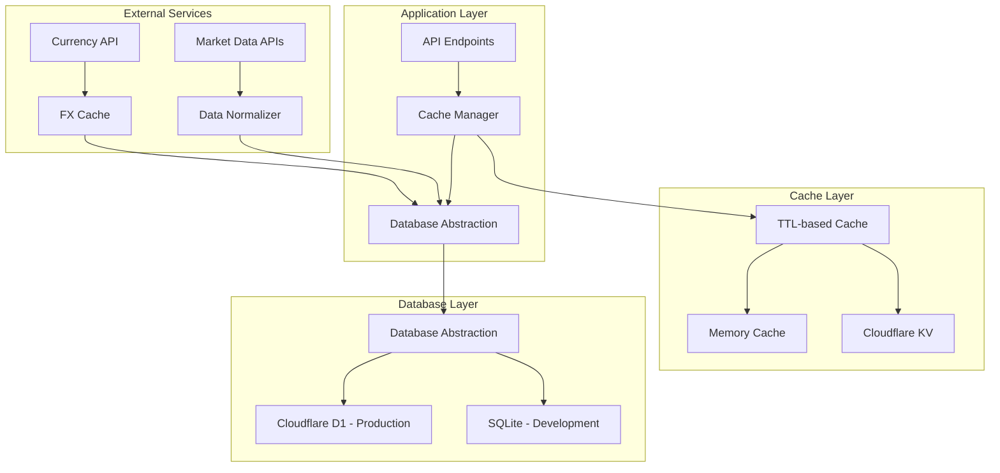
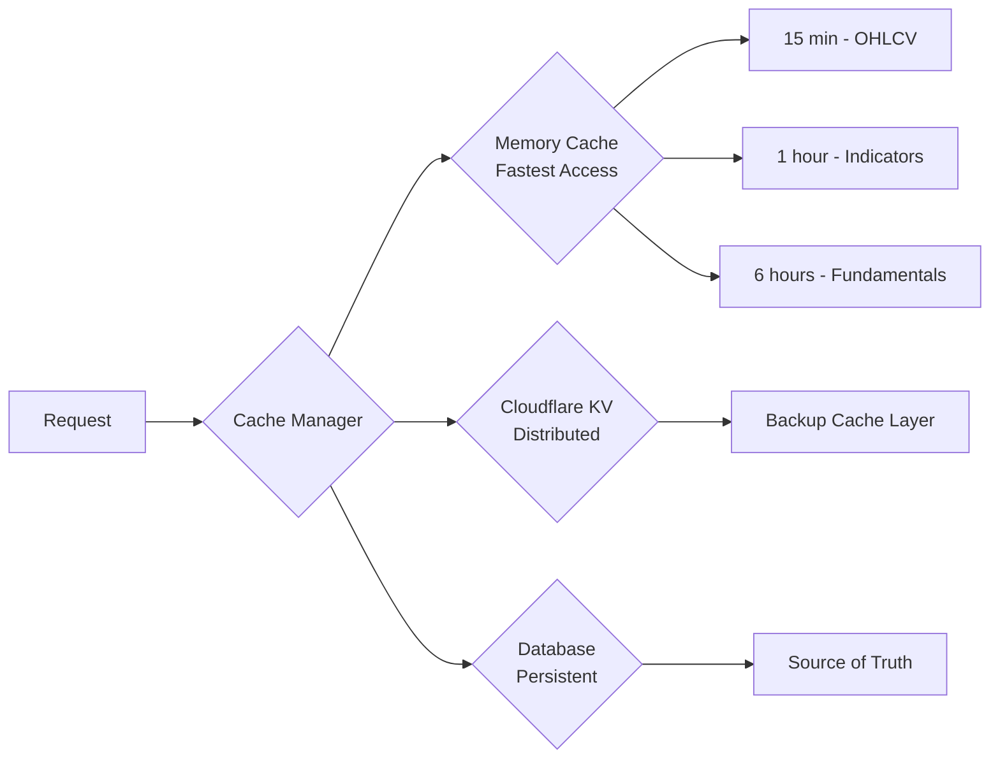

# Enhanced Caching and Database Layer Architecture

## Overview

This document outlines the architecture for upgrading the AI Stock Picker from in-memory caching to a persistent database layer with enhanced caching capabilities.

## Current Architecture Analysis

### Existing Components
- **In-Memory Cache**: NodeCache with 15-minute TTL
- **Data Sources**: Yahoo Finance, AlphaVantage APIs
- **API Endpoints**: 
  - `/api/analyze/:symbol` - Individual stock analysis
  - `/api/top-picks` - Watchlist analysis with KV caching
- **Tech Stack**: Node.js, Express, Cloudflare Workers

### Pain Points Identified
1. **Data Loss**: In-memory cache cleared on server restart
2. **Limited Historical Data**: Only ~50 days stored per request
3. **No Data Normalization**: No handling of splits/dividends
4. **Currency Issues**: No automatic CAD to USD conversion
5. **Scalability**: Cache doesn't scale across instances

## Proposed Architecture

### 1. Database Layer Design



### 2. Database Schema Design

#### Core Tables

**stocks** - Master stock information
```sql
CREATE TABLE stocks (
    id INTEGER PRIMARY KEY AUTOINCREMENT,
    symbol TEXT NOT NULL UNIQUE,
    name TEXT,
    currency TEXT DEFAULT 'USD',
    exchange TEXT,
    isin TEXT,
    created_at TIMESTAMP DEFAULT CURRENT_TIMESTAMP,
    updated_at TIMESTAMP DEFAULT CURRENT_TIMESTAMP,
    UNIQUE(symbol)
);
```

**ohlcv_data** - Historical price data
```sql
CREATE TABLE ohlcv_data (
    id INTEGER PRIMARY KEY AUTOINCREMENT,
    stock_id INTEGER NOT NULL,
    date DATE NOT NULL,
    open REAL,
    high REAL,
    low REAL,
    close REAL,
    volume INTEGER,
    adjusted_close REAL, -- Post-split/dividend adjustment
    split_ratio REAL DEFAULT 1.0,
    dividend REAL DEFAULT 0.0,
    currency TEXT DEFAULT 'USD',
    data_source TEXT,
    created_at TIMESTAMP DEFAULT CURRENT_TIMESTAMP,
    FOREIGN KEY (stock_id) REFERENCES stocks(id),
    UNIQUE(stock_id, date)
);
```

**fundamentals** - Company financial data
```sql
CREATE TABLE fundamentals (
    id INTEGER PRIMARY KEY AUTOINCREMENT,
    stock_id INTEGER NOT NULL,
    metric_type TEXT NOT NULL, -- 'PE', 'EPS', 'MarketCap', etc.
    value REAL NOT NULL,
    currency TEXT DEFAULT 'USD',
    period_ending DATE,
    reported_date DATE,
    data_source TEXT,
    created_at TIMESTAMP DEFAULT CURRENT_TIMESTAMP,
    FOREIGN KEY (stock_id) REFERENCES stocks(id),
    UNIQUE(stock_id, metric_type, period_ending)
);
```

**indicators** - Computed technical indicators
```sql
CREATE TABLE indicators (
    id INTEGER PRIMARY KEY AUTOINCREMENT,
    stock_id INTEGER NOT NULL,
    indicator_type TEXT NOT NULL, -- 'RSI', 'SMA50', 'MACD', etc.
    value REAL NOT NULL,
    date DATE NOT NULL,
    parameters TEXT, -- JSON string of calculation parameters
    created_at TIMESTAMP DEFAULT CURRENT_TIMESTAMP,
    FOREIGN KEY (stock_id) REFERENCES stocks(id),
    UNIQUE(stock_id, indicator_type, date, parameters)
);
```

**currency_rates** - FX conversion rates
```sql
CREATE TABLE currency_rates (
    id INTEGER PRIMARY KEY AUTOINCREMENT,
    from_currency TEXT NOT NULL,
    to_currency TEXT NOT NULL,
    rate REAL NOT NULL,
    source_rate REAL, -- Original API rate before caching
    expires_at TIMESTAMP NOT NULL,
    data_source TEXT,
    created_at TIMESTAMP DEFAULT CURRENT_TIMESTAMP,
    UNIQUE(from_currency, to_currency)
);
```

**cache_metadata** - TTL and cache management
```sql
CREATE TABLE cache_metadata (
    id INTEGER PRIMARY KEY AUTOINCREMENT,
    cache_key TEXT NOT NULL UNIQUE,
    expires_at TIMESTAMP NOT NULL,
    data_type TEXT, -- 'OHLCV', 'FUNDAMENTALS', 'INDICATORS'
    access_count INTEGER DEFAULT 0,
    last_accessed TIMESTAMP DEFAULT CURRENT_TIMESTAMP
);
```

### 3. Database Abstraction Layer

#### Interface Design
```javascript
// lib/database/DatabaseInterface.js
export interface DatabaseInterface {
  // Stock management
  getStock(symbol: string): Promise<Stock | null>;
  createStock(stock: Stock): Promise<void>;
  updateStock(symbol: string, updates: Partial<Stock>): Promise<void>;
  
  // OHLCV data
  getOHLCV(symbol: string, startDate: Date, endDate: Date): Promise<OHLCV[]>;
  saveOHLCV(symbol: string, data: OHLCV[]): Promise<void>;
  
  // Fundamentals
  getFundamentals(symbol: string, type?: string): Promise<Fundamental[]>;
  saveFundamentals(symbol: string, data: Fundamental[]): Promise<void>;
  
  // Indicators
  getIndicators(symbol: string, type?: string, startDate?: Date): Promise<Indicator[]>;
  saveIndicators(symbol: string, data: Indicator[]): Promise<void>;
  
  // Currency rates
  getCurrencyRate(from: string, to: string): Promise<number | null>;
  saveCurrencyRate(from: string, to: string, rate: number, expiresAt: Date): Promise<void>;
  
  // Cache management
  isCacheValid(key: string): Promise<boolean>;
  updateCacheMetadata(key: string, dataType: string, ttlMinutes: number): Promise<void>;
  cleanupExpiredCache(): Promise<void>;
}
```

#### Implementation Strategy
- **Production**: Cloudflare D1 with prepared statements
- **Development**: SQLite with identical schema
- **Environment Detection**: Automatic based on `process.env.CLOUDFLARE_ENV`

### 4. Enhanced Caching Strategy

#### Multi-Layer Cache Architecture


#### TTL Strategy
- **OHLCV Data**: 15 minutes (volatile market data)
- **Technical Indicators**: 1 hour (computed values)
- **Fundamentals**: 6 hours (less frequently updated)
- **Currency Rates**: 1 hour (FX API limitations)
- **Stock Metadata**: 24 hours (static information)

### 5. Data Normalization Pipeline

#### Split and Dividend Handling
```javascript
// lib/data/normalizer.js
export class DataNormalizer {
  async normalizeOHLCV(symbol: string, rawData: OHLCV[]): Promise<OHLCV[]> {
    // 1. Fetch corporate actions (splits/dividends)
    const actions = await this.getCorporateActions(symbol);
    
    // 2. Apply backward adjustments
    return rawData.map(day => {
      const action = actions.find(a => a.date <= day.date);
      if (!action) return day;
      
      return {
        ...day,
        open: day.open / action.adjustmentFactor,
        high: day.high / action.adjustmentFactor,
        low: day.low / action.adjustmentFactor,
        close: day.close / action.adjustmentFactor,
        adjusted_close: day.close,
        split_ratio: action.splitRatio,
        dividend: action.dividendAmount
      };
    });
  }
  
  async getCorporateActions(symbol: string): Promise<CorporateAction[]> {
    // Fetch from database or API
    // Cache results for 24 hours
  }
}
```

#### Currency Conversion
```javascript
// lib/data/currency.js
export class CurrencyService {
  async convertToUSD(symbol: string, amount: number, currency: string): Promise<number> {
    if (currency === 'USD') return amount;
    
    const rate = await this.getExchangeRate(currency, 'USD');
    return amount * rate;
  }
  
  async getExchangeRate(from: string, to: string): Promise<number> {
    // 1. Check cache
    const cached = await this.getCachedRate(from, to);
    if (cached && !this.isExpired(cached)) {
      return cached.rate;
    }
    
    // 2. Fetch from API
    const rate = await this.fetchFromAPI(from, to);
    
    // 3. Cache result
    await this.cacheRate(from, to, rate);
    
    return rate;
  }
}
```

### 6. Integration Points

#### API Endpoint Updates
```javascript
// Updated analyze endpoint
app.get('/api/analyze/:symbol', async (req, res) => {
  const { symbol } = req.params;
  const cacheKey = `analyze_${symbol}`;
  
  // 1. Check cache
  if (await cacheManager.isCached(cacheKey)) {
    return res.json(await cacheManager.get(cacheKey));
  }
  
  // 2. Check database
  const dbData = await db.getOHLCV(symbol, startDate, endDate);
  if (dbData.length > 0) {
    const analysis = await computeAnalysis(dbData);
    await cacheManager.set(cacheKey, analysis, 60); // 1 hour
    return res.json(analysis);
  }
  
  // 3. Fetch from API
  const apiData = await fetchMarketData(symbol);
  const normalizedData = await normalizer.normalize(apiData);
  
  // 4. Save to database
  await db.saveOHLCV(symbol, normalizedData);
  
  // 5. Compute and cache
  const analysis = await computeAnalysis(normalizedData);
  await cacheManager.set(cacheKey, analysis, 60);
  
  res.json(analysis);
});
```

### 7. Migration Strategy

#### Phase 1: Database Setup
1. Create D1 database instance
2. Run schema migration scripts
3. Set up development SQLite environment

#### Phase 2: Gradual Integration
1. Implement database abstraction layer
2. Update one endpoint at a time
3. Maintain backward compatibility during transition

#### Phase 3: Full Migration
1. Migrate all endpoints
2. Remove in-memory cache dependencies
3. Optimize database queries and indexes

### 8. Monitoring and Health Checks

#### Database Health Endpoints
```javascript
app.get('/health/database', async (req, res) => {
  const health = await db.getHealthStatus();
  res.json({
    status: health.healthy ? 'ok' : 'error',
    connection: health.connection,
    cacheHitRate: await cacheManager.getHitRate(),
    lastUpdated: health.lastUpdated
  });
});

app.get('/metrics/cache', async (req, res) => {
  res.json({
    hitRate: await cacheManager.getHitRate(),
    memoryUsage: process.memoryUsage(),
    cacheSize: await cacheManager.getSize()
  });
});
```

### 9. Configuration Updates

#### Updated wrangler.toml
```toml
name = "ai-stock-picker"
compatibility_date = "2025-01-01"
pages_build_output_dir = "./public"

[vars]
API_KEY = "YOUR_API_KEY_HERE"
CURRENCY_API_KEY = "YOUR_FX_API_KEY"
ENVIRONMENT = "production"

[[kv_namespaces]]
binding = "TOP_PICKS_KV"
id = "TOP_PICKS_KV_ID"

[[d1_databases]]
binding = "DB"
database_name = "ai-stock-picker-db"
database_id = "YOUR_D1_DATABASE_ID"

[env.development]
[env.development.vars]
ENVIRONMENT = "development"
```

### 10. Performance Considerations

#### Query Optimization
- Indexes on frequently queried columns
- Prepared statements for common operations
- Batch operations for bulk data inserts
- Connection pooling for database operations

#### Cache Optimization
- LRU (Least Recently Used) eviction policy
- Cache warming for popular stocks
- Asynchronous cache updates
- Compression for large datasets

### 11. Error Handling and Resilience

#### Fallback Strategies
1. **Database Unavailable**: Fall back to API with in-memory cache
2. **Cache Miss**: Fetch from database, then API if needed
3. **API Rate Limit**: Use cached data with freshness warnings
4. **Currency API Down**: Use last known rate with timestamp

#### Data Consistency
- Transaction support for critical operations
- Data validation before insertion
- Audit logs for data changes
- Backup and recovery procedures

## Implementation Timeline

### Week 1: Foundation
- [ ] Set up D1 database and schema
- [ ] Create database abstraction layer
- [ ] Implement basic CRUD operations

### Week 2: Core Features
- [ ] Implement caching layer
- [ ] Add currency conversion service
- [ ] Create data normalization pipeline

### Week 3: Integration
- [ ] Update API endpoints
- [ ] Add monitoring and health checks
- [ ] Performance testing and optimization

### Week 4: Deployment
- [ ] Production deployment
- [ ] Monitoring and alerting setup
- [ ] Documentation and handoff

## Success Metrics

1. **Performance**: 90% cache hit rate for popular stocks
2. **Reliability**: 99.9% uptime with graceful degradation
3. **Scalability**: Support 10x current traffic
4. **Data Quality**: 95% accuracy in normalized data
5. **Developer Experience**: Zero-downtime deployments

## Risks and Mitigation

1. **D1 API Limitations**: Implement fallback to KV storage
2. **Data Migration Complexity**: Use phased migration approach
3. **Performance Degradation**: Extensive load testing before production
4. **Currency API Costs**: Implement intelligent caching to minimize API calls

## Next Steps

1. Review and approve this architecture document
2. Set up development environment with D1
3. Begin implementation of database abstraction layer
4. Create detailed technical specifications for each component