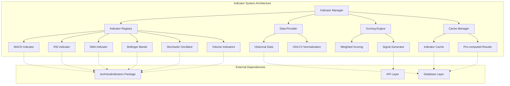

# Basic Technical Indicators Expansion Architecture

## Overview

This document outlines the architecture for expanding the AI Stock Picker's technical indicator capabilities beyond RSI and SMA to include MACD, Bollinger Bands, Stochastic Oscillator, and Volume indicators. The expansion focuses on creating a modular, scalable indicator library with advanced multi-indicator scoring.

## Current State Analysis

### Existing Implementation
- **Current Indicators**: RSI (14-period), SMA (50-period)
- **Data Source**: Yahoo Finance API
- **Historical Data**: ~50 days
- **Scoring**: Simple RSI-based with volume momentum and linear forecast
- **Architecture**: Hard-coded calculations in `lib/analyze.js`

### Limitations Identified
1. **Limited Indicator Set**: Only 2 basic indicators
2. **Insufficient Historical Data**: 50 days insufficient for accurate MACD/Bollinger Bands
3. **Manual Calculations**: Prone to errors, not optimized
4. **Simple Scoring**: No weighted multi-indicator approach
5. **No Modularity**: Difficult to add new indicators
6. **Performance**: Calculations done on every request

## Architecture Goals

### Primary Objectives
1. **Modular Design**: Pluggable indicator system for easy expansion
2. **Accurate Calculations**: Use industry-standard `technicalindicators` package
3. **Enhanced Data Requirements**: Support 100+ days of historical data
4. **Advanced Scoring**: Weighted multi-indicator scoring system
5. **Performance Optimization**: Caching and pre-computation strategies
6. **Extensibility**: Easy addition of future indicators

### Success Metrics
- **Indicator Accuracy**: 99% correlation with standard implementations
- **Performance**: <200ms for full indicator suite calculation
- **Scalability**: Support 10+ concurrent indicator calculations
- **Maintainability**: Clear separation of concerns, testable modules
- **Extensibility**: New indicators addable in <2 hours

## System Architecture

### Modular Indicator Library Design



### Core Components

#### 1. Indicator Interface Design
```javascript
// lib/indicators/IndicatorInterface.js
export interface IndicatorInterface {
  name: string;
  version: string;
  requiredPeriods: number;
  parameters: IndicatorParameters;
  
  calculate(data: OHLCVData[]): IndicatorResult;
  validateParameters(params: IndicatorParameters): boolean;
  getOptimalParameters(): IndicatorParameters;
}

// Base indicator result structure
export interface IndicatorResult {
  name: string;
  value: number | IndicatorValues;
  signal: IndicatorSignal;
  confidence: number;
  timestamp: Date;
  metadata: {
    period: number;
    parameters: IndicatorParameters;
    dataPoints: number;
  }
}
```

#### 2. Indicator Registry System
```javascript
// lib/indicators/IndicatorRegistry.js
export class IndicatorRegistry {
  private indicators: Map<string, IndicatorInterface> = new Map();
  
  register(indicator: IndicatorInterface): void;
  get(name: string): IndicatorInterface | null;
  getAll(): IndicatorInterface[];
  calculateAll(data: OHLCVData[], names?: string[]): Map<string, IndicatorResult>;
}
```

#### 3. Data Provider Architecture
```javascript
// lib/indicators/DataProvider.js
export class DataProvider {
  constructor(databaseService: DatabaseService);
  
  getHistoricalData(symbol: string, days: number): Promise<OHLCVData[]>;
  normalizeData(rawData: any[]): OHLCVData[];
  validateDataCompleteness(data: OHLCVData[], requiredDays: number): boolean;
  fillMissingData(data: OHLCVData[]): OHLCVData[];
}
```

## Indicator Specifications

### 1. MACD (Moving Average Convergence Divergence)

**Parameters**:
- Fast Period: 12
- Slow Period: 26
- Signal Period: 9

**Calculation**:
```javascript
// Using technicalindicators MACD
const macdInput = {
  values: closes,
  fastPeriod: 12,
  slowPeriod: 26,
  signalPeriod: 9,
  SimpleMA: false
};

const macdResult = MACD.calculate(macdInput);
```

**Signal Logic**:
- **Buy**: MACD line crosses above Signal line
- **Sell**: MACD line crosses below Signal line
- **Hold**: No crossover, assess divergence

**Confidence Factors**:
- Histogram strength
- Distance from zero line
- Recent crossover confirmation

### 2. Bollinger Bands

**Parameters**:
- Period: 20
- Standard Deviations: 2

**Calculation**:
```javascript
const bollingerInput = {
  period: 20,
  values: closes,
  stdDev: 2
};

const bollingerResult = BollingerBands.calculate(bollingerInput);
```

**Signal Logic**:
- **Buy**: Price touches lower band with reversal confirmation
- **Sell**: Price touches upper band with reversal confirmation
- **Hold**: Price within middle band range

**Enhanced Signals**:
- Band width (volatility assessment)
- Band squeeze patterns
- Price position relative to bands

### 3. Stochastic Oscillator

**Parameters**:
- %K Period: 14
- %D Period: 3
- Slowing: 3

**Calculation**:
```javascript
const stochasticInput = {
  high: highs,
  low: lows,
  close: closes,
  period: 14,
  signalPeriod: 3
};

const stochasticResult = Stochastic.calculate(stochasticInput);
```

**Signal Logic**:
- **Buy**: %K crosses above %D in oversold zone (<20)
- **Sell**: %K crosses below %D in overbought zone (>80)
- **Hold**: Neutral zone (20-80)

### 4. Volume Indicators

**On-Balance Volume (OBV)**:
```javascript
const obvResult = OBV.calculate({
  volume: volumes,
  close: closes
});
```

**Volume Moving Average**:
```javascript
const volumeMA = SMA.calculate({
  period: 20,
  values: volumes
});
```

**Volume Ratio**:
- Current volume vs. average volume
- Volume surge detection
- Volume confirmation of price moves

## Multi-Indicator Scoring System

### Weighted Scoring Algorithm

```javascript
// lib/indicators/ScoringEngine.js
export class ScoringEngine {
  private weights: Map<string, number> = new Map([
    ['MACD', 0.25],
    ['RSI', 0.20],
    ['BollingerBands', 0.20],
    ['Stochastic', 0.15],
    ['Volume', 0.10],
    ['SMA', 0.10]
  ]);

  calculateCompositeScore(results: Map<string, IndicatorResult>): CompositeScore {
    let totalScore = 0;
    let totalWeight = 0;
    
    for (const [name, result] of results) {
      const weight = this.weights.get(name) || 0.1;
      const weightedScore = this.normalizeSignal(result.signal) * weight * result.confidence;
      
      totalScore += weightedScore;
      totalWeight += weight * result.confidence;
    }
    
    const finalScore = totalWeight > 0 ? totalScore / totalWeight : 0;
    
    return {
      score: this.normalizeScore(finalScore),
      signal: this.deriveSignal(finalScore),
      confidence: this.calculateConfidence(results),
      breakdown: this.createBreakdown(results)
    };
  }
}
```

### Signal Derivation Logic

**Score Ranges**:
- **Buy**: 70-100 (Strong momentum, multiple confirmations)
- **Hold**: 30-70 (Neutral, mixed signals)
- **Sell**: 0-30 (Weak momentum, bearish indicators)

**Confidence Calculation**:
```javascript
calculateConfidence(results: Map<string, IndicatorResult>): number {
  const confidences = Array.from(results.values()).map(r => r.confidence);
  const avgConfidence = confidences.reduce((a, b) => a + b, 0) / confidences.length;
  
  // Boost confidence for consensus
  const consensusFactor = this.calculateConsensusFactor(results);
  
  return Math.min(1, avgConfidence * consensusFactor);
}
```

### Consensus Analysis

**Indicator Agreement**:
- **High Agreement**: 4+ indicators align (confidence × 1.2)
- **Medium Agreement**: 3 indicators align (confidence × 1.0)
- **Low Agreement**: 2 indicators align (confidence × 0.8)
- **Disagreement**: Mixed signals (confidence × 0.6)

## Data Architecture

### Enhanced Historical Data Requirements

**Current vs. Required**:
- **Current**: 50 days
- **Required**: 100+ days for accurate MACD/Bollinger Bands
- **Recommended**: 150 days for robust analysis

**Data Structure**:
```typescript
interface OHLCVData {
  date: Date;
  open: number;
  high: number;
  low: number;
  close: number;
  volume: number;
  adjustedClose?: number;
  splitRatio?: number;
  dividend?: number;
}
```

### Database Schema Updates

**Enhanced indicators table**:
```sql
ALTER TABLE indicators ADD COLUMN parameters JSON;
ALTER TABLE indicators ADD COLUMN confidence REAL DEFAULT 1.0;
ALTER TABLE indicators ADD COLUMN signal_type TEXT; -- 'BUY', 'SELL', 'HOLD'

-- Composite scores table
CREATE TABLE composite_scores (
    id INTEGER PRIMARY KEY AUTOINCREMENT,
    stock_id INTEGER NOT NULL,
    score REAL NOT NULL,
    signal TEXT NOT NULL,
    confidence REAL NOT NULL,
    breakdown JSON NOT NULL,
    calculated_at TIMESTAMP DEFAULT CURRENT_TIMESTAMP,
    data_points INTEGER,
    FOREIGN KEY (stock_id) REFERENCES stocks(id),
    UNIQUE(stock_id, calculated_at)
);
```

### Caching Strategy

**Multi-Level Caching**:
1. **Memory Cache**: Recent calculations (15 minutes)
2. **Database Cache**: Pre-computed daily scores (24 hours)
3. **Indicator Cache**: Individual indicator results (1 hour)

**Cache Keys**:
- `indicator:{symbol}:{indicator_name}:{parameters}:{date_range}`
- `composite:{symbol}:{date_range}`
- `daily_scores:{symbol}:{date}`

## Performance Optimization

### Calculation Optimization

**Batch Processing**:
```javascript
// lib/indicators/BatchProcessor.js
export class BatchProcessor {
  async calculateForSymbols(
    symbols: string[], 
    indicators: string[]
  ): Promise<Map<string, Map<string, IndicatorResult>>> {
    
    // Parallel data fetching
    const dataPromises = symbols.map(symbol => 
      this.dataProvider.getHistoricalData(symbol, 150)
    );
    
    const datasets = await Promise.all(dataPromises);
    
    // Parallel indicator calculations
    const results = new Map();
    for (let i = 0; i < symbols.length; i++) {
      const symbol = symbols[i];
      const data = datasets[i];
      
      results.set(symbol, this.registry.calculateAll(data, indicators));
    }
    
    return results;
  }
}
```

**Lazy Loading**:
- Load only requested indicators
- Defer expensive calculations
- Cache intermediate results

### Memory Management

**Data Windowing**:
- Maintain rolling 200-day windows
- Automatic cleanup of stale data
- Efficient data structure usage

**Calculation Caching**:
- Memoization of expensive operations
- Reuse common sub-calculations
- Smart cache invalidation

## API Integration

### Enhanced Analysis Endpoint

**Request Structure**:
```javascript
GET /api/analyze/:symbol
Query Parameters:
- indicators: comma-separated list (optional, defaults to all)
- days: historical data days (optional, default: 150)
- scoring: scoring method (optional: 'weighted', 'simple')
```

**Response Structure**:
```javascript
{
  symbol: "AAPL",
  currentPrice: 150.25,
  currency: "USD",
  indicators: {
    RSI: {
      value: 45,
      signal: "HOLD",
      confidence: 0.8,
      parameters: { period: 14 }
    },
    MACD: {
      value: { macd: 1.2, signal: 0.8, histogram: 0.4 },
      signal: "BUY",
      confidence: 0.9,
      parameters: { fast: 12, slow: 26, signal: 9 }
    },
    // ... other indicators
  },
  composite: {
    score: 75,
    signal: "BUY",
    confidence: 0.85,
    breakdown: {
      MACD: { score: 85, weight: 0.25 },
      RSI: { score: 65, weight: 0.20 },
      // ... other indicators
    }
  },
  metadata: {
    dataPoints: 150,
    calculationTime: 145,
    indicatorsCalculated: 6
  }
}
```

### Top Picks Enhancement

**Enhanced Scoring**:
```javascript
GET /api/top-picks
Response:
{
  top10: [
    {
      symbol: "AAPL",
      compositeScore: 85,
      signal: "STRONG_BUY",
      confidence: 0.9,
      indicators: {
        RSI: 45,
        MACD: "BULLISH",
        BollingerBands: "NEUTRAL",
        // ...
      },
      price: 150.25,
      change: 2.5
    }
  ],
  scoringMethod: "weighted",
  calculatedAt: "2025-12-06T09:00:00Z"
}
```

## Implementation Plan

### Phase 1: Core Infrastructure (Day 1)

**Tasks**:
1. Add `technicalindicators` dependency
2. Create indicator interface and base classes
3. Implement indicator registry system
4. Create data provider with 150-day data fetching

**Deliverables**:
- `lib/indicators/IndicatorInterface.js`
- `lib/indicators/IndicatorRegistry.js`
- `lib/indicators/DataProvider.js`
- Updated `package.json`

### Phase 2: Indicator Implementation (Day 2)

**Tasks**:
1. Implement RSI and SMA (refactored)
2. Implement MACD indicator
3. Implement Bollinger Bands indicator
4. Create indicator factory

**Deliverables**:
- `lib/indicators/RSI.js`
- `lib/indicators/SMA.js`
- `lib/indicators/MACD.js`
- `lib/indicators/BollingerBands.js`
- `lib/indicators/IndicatorFactory.js`

### Phase 3: Advanced Indicators (Day 3)

**Tasks**:
1. Implement Stochastic Oscillator
2. Implement Volume indicators (OBV, Volume MA)
3. Create composite scoring engine
4. Implement caching layer

**Deliverables**:
- `lib/indicators/Stochastic.js`
- `lib/indicators/Volume.js`
- `lib/indicators/ScoringEngine.js`
- `lib/indicators/CacheManager.js`

### Phase 4: Integration & Optimization (Day 4)

**Tasks**:
1. Update analysis API endpoints
2. Enhance top picks functionality
3. Performance optimization and testing
4. Documentation and validation

**Deliverables**:
- Updated `src/server.js` with new endpoints
- Performance benchmarks
- Comprehensive documentation
- Test suite

## Testing Strategy

### Unit Testing

**Indicator Tests**:
```javascript
describe('MACD Indicator', () => {
  it('should calculate MACD correctly', () => {
    const closes = [100, 101, 102, 103, 104];
    const result = macd.calculate(closes);
    
    expect(result.macd).toBeCloseTo(expectedMACD);
    expect(result.signal).toBeCloseTo(expectedSignal);
    expect(result.histogram).toBeCloseTo(expectedHistogram);
  });
});
```

### Integration Testing

**End-to-End Tests**:
```javascript
describe('Indicator System', () => {
  it('should calculate all indicators for AAPL', async () => {
    const result = await analyzeSymbol('AAPL');
    
    expect(result.indicators).toHaveProperty('RSI');
    expect(result.indicators).toHaveProperty('MACD');
    expect(result.indicators).toHaveProperty('BollingerBands');
    expect(result.composite).toBeDefined();
  });
});
```

### Performance Testing

**Benchmarks**:
- 50 symbols × 6 indicators < 5 seconds
- Single symbol full analysis < 200ms
- Memory usage < 100MB for 100 symbols

## Risk Mitigation

### Technical Risks

1. **Performance Degradation**
   - *Mitigation*: Caching, batch processing, lazy loading
   - *Fallback*: Simplified scoring mode

2. **Data Quality Issues**
   - *Mitigation*: Data validation, missing data handling
   - *Fallback*: Reduced indicator set

3. **Library Compatibility**
   - *Mitigation*: Thorough testing, version pinning
   - *Fallback*: Custom implementations for critical indicators

### Operational Risks

1. **API Rate Limiting**
   - *Mitigation*: Aggressive caching, batch requests
   - *Fallback*: Reduced update frequency

2. **Memory Usage**
   - *Mitigation*: Data windowing, cleanup strategies
   - *Fallback*: Smaller data windows

## Monitoring and Maintenance

### Key Metrics

**Performance Metrics**:
- Indicator calculation time
- API response time
- Cache hit rates
- Memory usage

**Quality Metrics**:
- Indicator accuracy vs. benchmarks
- Signal consistency
- Composite score distribution

### Alerting

**Performance Alerts**:
- Calculation time > 500ms
- API response time > 1s
- Cache hit rate < 80%

**Quality Alerts**:
- Indicator deviation > 5% from expected
- Composite score anomalies
- Data completeness issues

## Future Enhancements

### Indicator Expansion
- **Fibonacci Retracement**: Support/resistance levels
- **Ichimoku Cloud**: Comprehensive trend analysis
- **ADX**: Trend strength measurement
- **Williams %R**: Momentum indicator

### Advanced Features
- **Machine Learning Integration**: Pattern recognition
- **Custom Indicator Builder**: User-defined indicators
- **Real-time Updates**: WebSocket-based streaming
- **Backtesting Framework**: Strategy validation

### Performance Improvements
- **Web Workers**: Off-main-thread calculations
- **Streaming Calculations**: Real-time updates
- **Distributed Processing**: Multi-core utilization

This architecture provides a solid foundation for expanding the AI Stock Picker's technical analysis capabilities while maintaining performance, accuracy, and maintainability.