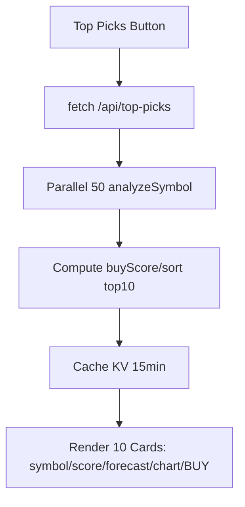

# AI Top Picks Stock Screener - Technical Specification

## Overview
"AI Top Picks" is a new feature that screens a hardcoded watchlist of 50 high-volume S&P 500 stocks, computes a composite buyScore (0-100), and surfaces the top 10 with forecasts, charts, and BUY signals. Leverages existing [`lib/analyze.js`](lib/analyze.js) for data fetching (Yahoo Finance), enhances it with new metrics, adds a dedicated Cloudflare Worker API, frontend UI tab, tests, and deployment instructions. Designed for low-latency parallel processing with 15min caching.

## Watchlist
Hardcode exactly 50 high-volume S&P 500 leaders (top by market cap/volume as of late 2024 knowledge):

```javascript
// lib/watchlist.js
export const WATCHLIST = [
  'AAPL', 'MSFT', 'NVDA', 'TSLA', 'AMZN', 'META', 'GOOGL', 'GOOG', 'BRK-B', 'LLY',
  'AVGO', 'JPM', 'UNH', 'V', 'MA', 'PG', 'XOM', 'JNJ', 'HD', 'COST',
  'MRK', 'ABBV', 'NFLX', 'WMT', 'BAC', 'KO', 'CVX', 'AMD', 'PEP', 'ORCL',
  'LIN', 'TMUS', 'ACN', 'CSCO', 'ABT', 'TXN', 'WFC', 'INTC', 'PFE', 'PM',
  'DHR', 'NEE', 'T', 'SPGI', 'COP', 'ETN', 'AXP', 'GS', 'RTX', 'CRM'
];
```

## Formulas & Metrics (Enhance [`lib/analyze.js`](lib/analyze.js))
Assume `historical` now includes `volume` (enhance mapping). All scores normalized 0-100. Export pure functions:

1. **volumeMomentum(historical)**:
   ```
   const volumes = historical.slice(-11).map(h => h.volume).filter(v => v > 0);
   if (volumes.length < 11) return 0;
   const latestVol = volumes[volumes.length - 1];
   const avgPrev10 = volumes.slice(0, -1).reduce((a, b) => a + b, 0) / 10;
   const ratio = latestVol / avgPrev10;
   return Math.max(0, Math.min(100, (ratio - 0.5) * 200));  // 0.5x=0, 1x=100, >1.25x=100
   ```

2. **linearForecast(historical, currentPrice)**:
   ```
   const last10 = historical.slice(-10).map(h => h.close);
   if (last10.length < 10) return 0;
   const n = 10;
   const x = Array.from({length: n}, (_, i) => i);  // [0,1,...,9]
   const y = last10;
   const sumX = x.reduce((a,b)=>a+b,0);
   const sumY = y.reduce((a,b)=>a+b,0);
   const sumXY = x.reduce((sum, xi, i) => sum + xi * y[i], 0);
   const sumX2 = x.reduce((sum, xi) => sum + xi*xi, 0);
   const slope = (n * sumXY - sumX * sumY) / (n * sumX2 - sumX * sumX);
   return Math.max(-50, Math.min(50, (slope * 7 / currentPrice) * 100));  // Cap forecast ±50%
   ```

3. **buyScore(analysis)**: `0-100 total = (RSI_oversold * 0.5) + (price_vs_sma * 0.3) + (volume_momentum * 0.2)`
   ```
   const { rsi, currentPrice, sma50, historical } = analysis;
   const rsiOversold = Math.max(0, Math.min(100, (70 - rsi) / 40 * 100));
   const priceVsSma = Math.max(0, (currentPrice / sma50 - 1) * 100);
   const volMom = volumeMomentum(historical);
   return Math.min(100, rsiOversold * 0.5 + priceVsSma * 0.3 + volMom * 0.2);
   ```

**Enhance [`analyzeSymbol`](lib/analyze.js:38)**: Include `volume` in `historical` mapping:
```
historical: historical.slice(-50).map(h => ({
  date: h.date,
  close: parseFloat(h.close),
  volume: parseInt(h.volume) || 0
}))
```
Return also includes `historical` with volumes for derived metrics.

## API: [`functions/api/top-picks/index.js`](functions/api/top-picks/index.js) (New)
```
import { WATCHLIST } from '../../../lib/watchlist.js';
import { analyzeSymbol, volumeMomentum, linearForecast, buyScore } from '../../../lib/analyze.js';

export default {
  async fetch(request, env, ctx) {
    // Cache: Use KV (bind TOP_PICKS_KV in wrangler.toml) or caches.default
    const cacheKey = 'top-picks-cache';
    const cached = await env.TOP_PICKS_KV?.get(cacheKey, {type: 'json'});
    if (cached && Date.now() - cached.timestamp < 900000) {  // 15min
      return Response.json(cached.top10);
    }

    const analyses = await Promise.all(
      WATCHLIST.map(async (symbol) => {
        try {
          const data = await analyzeSymbol(symbol);
          return {
            ...data,
            volumeMomentum: volumeMomentum(data.historical),
            forecastGainPct: linearForecast(data.historical, data.currentPrice),
            buyScore: buyScore(data)
          };
        } catch {
          return null;  // Skip errors
        }
      })
    );

    const valid = analyses.filter(Boolean);
    const top10 = valid
      .map(a => ({
        symbol: a.symbol || 'UNKNOWN',  // Add symbol to analyzeSymbol return
        score: a.buyScore,
        signal: a.buyScore > 60 ? 'BUY' : 'HOLD',
        priceChart: a.historical.slice(-10).map(h => h.close),
        forecastGainPct: a.forecastGainPct,
        currentPrice: a.currentPrice,
        rsi: a.rsi,
        sma50: a.sma50
      }))
      .sort((a,b) => b.score - a.score)
      .slice(0,10);

    const responseData = { top10, timestamp: Date.now() };
    await env.TOP_PICKS_KV?.put(cacheKey, JSON.stringify(responseData), { expirationTtl: 900 });
    return Response.json(top10);
  }
};
```
**Enhance [`analyzeSymbol`](lib/analyze.js)**: Add `symbol` to return object.

**Exact JSON Schema** (top10 array):
```json
[
  {
    "symbol": "string",
    "score": "number (0-100)",
    "signal": "BUY|HOLD",
    "priceChart": ["number[] (last 10 closes)"],
    "forecastGainPct": "number (±50 cap)",
    "currentPrice": "number",
    "rsi": "number",
    "sma50": "number"
  }
]
```

## Frontend: Enhance [`public/index.html`](public/index.html)
- Add "Top Picks" button/tab beside "SCAN MARKET".
- On click: fetch `/api/top-picks`, hide single-scan results, show grid of 10 cards.
- Each card: Symbol badge, score progress bar (green), forecast % (green if >0), mini `<canvas>` Chart.js line (priceChart data), "BUY" button (placeholder: alert('Buy ${symbol}')).
- Reuse existing Chart.js CDN.
- Responsive grid (CSS flex/grid).

**Text Wireframe** (Top Picks View):
```
┌──────────────────────────────┐
│ AI STOCK PICKER              │  [Top Picks] [Scan Market]
├──────────────────────────────┤
│ Loading top picks...         │
└──────────────────────────────┘
┌──────┬──────┬──────┐ ...
│AAPL  │MSFT  │NVDA  │
│Score │Score │Score │  <- Progress bars 95/100 green
│+2.3% │+1.8% │-0.5% │
│[mini line chart canvas]      │
│[BUY]                         │
└──────┴──────┴──────┘
```

**Mermaid UI Flow**:


## File-by-File Pseudocode Changes
1. **`lib/watchlist.js`** (New): `export const WATCHLIST = [...]`
2. **`lib/analyze.js`** (Enhance):
   - Add `volume` to historical map [`lib/analyze.js:94`]
   - Add/export `volumeMomentum(historical)`, `linearForecast(historical, currentPrice)`, `buyScore(analysis)`
   - Add `symbol` param to return
3. **`functions/api/top-picks/index.js`** (New): As above
4. **`public/index.html`** (Enhance):
   - Add button: `<button id="topPicks">TOP PICKS</button>`
   - JS: `topPicks.addEventListener... fetch('/api/top-picks').then(renderCards)`
   - Add `#topPicksResults` div grid, card template
   - Multiple Chart instances for minis
5. **`src/server.js`** (Mirror for local): Add `app.get('/api/top-picks', async...` duplicate logic (no KV, use node-cache)
6. **`tests/top-picks.test.js`** (New): Jest mock yahooFinance2, test functions, API response shape
7. **`README.md`** (Update): Add section "Top Picks", endpoints, screenshots
8. **`wrangler.toml`**: Add KV binding `[kv_namespaces] binding = "TOP_PICKS_KV"`

## Dependencies
- None new: `yahoo-finance2` (existing), `chart.js` CDN (existing)
- Dev: `jest` (existing)

## Deployment Steps
1. `npm install`
2. **Local Test**: `npm run dev:pages` (Cloudflare) or `npm start` (Express mirror)
3. **Cloudflare**:
   - `wrangler login`
   - `npm run deploy` (or Pages GitHub auto-deploy)
   - Verify `/api/top-picks`
4. **Update Routes**: Ensure `wrangler.toml` routes `/api/top-picks*` to `top-picks`
5. **KV Setup**: Dashboard > Workers > KV > Create namespace > Bind to service

## Tests
- Unit: `volumeMomentum`, `linearForecast`, `buyScore` (mock historical)
- Integration: Mock `analyzeSymbol`, test top10 sort/JSON
- `npm test`

## Risks/Notes
- Yahoo rate limits: Parallel 50 ok (~2s), cache mitigates
- BRK-B symbol: Yahoo uses 'BRK-B'
- Forecast: Simple linreg (not financial advice)
- Buy button: UI only, integrate broker API later

Ready for implementation in Code mode.