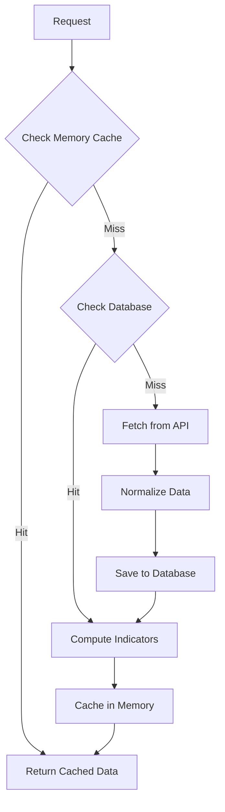

# API Integration Guide - Database Layer Integration

## Overview

This guide details how to update existing API endpoints to integrate with the new persistent database layer while maintaining backward compatibility and ensuring zero-downtime deployment.

## Current API Endpoints Analysis

### 1. `/api/analyze/:symbol` (src/server.js:44-93)
**Current Behavior:**
- Uses in-memory cache with 15-minute TTL
- Fetches data from Yahoo Finance API
- Computes RSI and SMA50 indicators
- No data persistence

**Integration Strategy:**


### 2. `/api/top-picks` (functions/api/top-picks/index.js)
**Current Behavior:**
- Uses Cloudflare KV for caching
- Processes entire watchlist
- Computes buy scores and forecasts

**Integration Strategy:**
- Replace KV with database-backed caching
- Pre-compute indicators for watchlist stocks
- Implement batch processing for efficiency

## Implementation Steps

### Step 1: Create Database Service Layer

#### Database Service Interface
```javascript
// lib/database/DatabaseService.js
export class DatabaseService {
  constructor(db) {
    this.db = db;
  }

  // Stock operations
  async getOrCreateStock(symbol, metadata = {}) {
    // Check if stock exists
    let stock = await this.db.getStock(symbol);
    if (!stock) {
      stock = await this.db.createStock({
        symbol,
        name: metadata.name,
        currency: metadata.currency || 'USD',
        exchange: metadata.exchange,
        isin: metadata.isin
      });
    }
    return stock;
  }

  // OHLCV operations with caching
  async getOHLCVWithCache(symbol, startDate, endDate, ttlMinutes = 15) {
    const cacheKey = `ohlcv:${symbol}:${startDate.toISOString()}:${endDate.toISOString()}`;
    
    // Check cache first
    const cached = await this.getFromCache(cacheKey);
    if (cached) {
      return cached;
    }

    // Check database
    const dbData = await this.db.getOHLCV(symbol, startDate, endDate);
    if (dbData.length > 0) {
      await this.setCache(cacheKey, dbData, ttlMinutes);
      return dbData;
    }

    return null;
  }

  // Indicator operations
  async getIndicatorsWithCache(symbol, indicatorTypes, date, ttlMinutes = 60) {
    const cacheKey = `indicators:${symbol}:${date.toISOString()}:${indicatorTypes.join(',')}`;
    
    const cached = await this.getFromCache(cacheKey);
    if (cached) {
      return cached;
    }

    const indicators = await this.db.getIndicators(symbol, indicatorTypes, date);
    if (indicators.length > 0) {
      await this.setCache(cacheKey, indicators, ttlMinutes);
      return indicators;
    }

    return null;
  }

  // Batch operations for top picks
  async getBatchIndicators(symbols, indicatorTypes, date) {
    const results = {};
    
    for (const symbol of symbols) {
      const indicators = await this.getIndicatorsWithCache(symbol, indicatorTypes, date, 60);
      if (indicators) {
        results[symbol] = indicators;
      }
    }
    
    return results;
  }
}
```

### Step 2: Update Individual Analysis Endpoint

#### Enhanced Analysis Function
```javascript
// lib/analyze.js - Enhanced version
export async function analyzeSymbolWithDB(symbol, interval = '1d', dbService) {
  const isTSX = isTSXSymbol(symbol);
  
  try {
    // 1. Try to get from database first
    const endDate = new Date();
    const startDate = new Date();
    startDate.setDate(endDate.getDate() - 50);
    
    let historical = await dbService.getOHLCVWithCache(symbol, startDate, endDate, 15);
    
    if (!historical) {
      // 2. Fetch from API if not in database
      const yahooFinance = new YahooFinance();
      const quote = await yahooFinance.quote(symbol);
      const currentPrice = quote.regularMarketPrice;
      
      if (!currentPrice) {
        throw new Error('Invalid symbol or no data available');
      }
      
      const currency = quote.currency || 'USD';
      validateCurrency(currency, isTSX);
      
      historical = await yahooFinance.historical(symbol, {
        period1: Math.floor(startDate.getTime() / 1000),
        period2: Math.floor(endDate.getTime() / 1000),
        interval: interval
      });
      
      if (!historical || historical.length === 0) {
        throw new Error('Insufficient historical data');
      }
      
      // 3. Normalize and save to database
      const normalizedData = await normalizer.normalizeOHLCV(symbol, historical);
      await dbService.saveOHLCV(symbol, normalizedData);
    }
    
    // 4. Compute indicators
    const closes = historical.map(h => parseFloat(h.close)).filter(c => !isNaN(c));
    const rsi = calculateRSI(closes);
    const sma50 = calculateSMA50(closes);
    
    // 5. Save indicators to database
    await dbService.saveIndicators(symbol, [
      { type: 'RSI', value: rsi, date: endDate },
      { type: 'SMA50', value: sma50, date: endDate }
    ]);
    
    // 6. Get current price (may need fresh fetch for real-time data)
    const currentPrice = await getCurrentPrice(symbol);
    
    return {
      currentPrice: parseFloat(currentPrice.toFixed(2)),
      currency: historical[0]?.currency || 'USD',
      sma50: parseFloat(sma50.toFixed(2)),
      rsi: parseFloat(rsi.toFixed(2)),
      signal: getSignal(rsi),
      historical: historical.slice(-50).map(h => ({
        date: h.date,
        close: parseFloat(h.close)
      }))
    };
    
  } catch (error) {
    logger.error(`Error analyzing ${symbol}`, { error: error.message, stack: error.stack });
    throw error;
  }
}
```

#### Updated Express Route
```javascript
// src/server.js - Updated route
app.get('/api/analyze/:symbol', async (req, res) => {
  const { symbol } = req.params;
  const cacheKey = `analyze_${symbol}`;
  
  try {
    // 1. Check in-memory cache first (fastest)
    const cached = cache.get(cacheKey);
    if (cached) {
      logger.info(`[CACHE HIT] ${symbol}`);
      return res.json(cached);
    }
    
    // 2. Initialize database service
    const dbService = new DatabaseService(env.DB);
    
    // 3. Get analysis with database integration
    const result = await analyzeSymbolWithDB(symbol, '1d', dbService);
    
    // 4. Cache result
    cache.set(cacheKey, result);
    
    logger.info(`Analysis complete for ${symbol}`, result);
    res.json(result);
    
  } catch (error) {
    logger.error(`Error analyzing ${symbol}`, { error: error.message, stack: error.stack });
    let status = 500;
    let errorMsg = error.message || 'Internal server error';

    if (errorMsg.includes('Invalid symbol') || errorMsg.includes('no data')) {
      status = 404;
    } else if (errorMsg.includes('Insufficient historical')) {
      status = 404;
    } else if (errorMsg.includes('RSI')) {
      status = 404;
    }

    res.status(status).json({ error: errorMsg });
  }
});
```

### Step 3: Update Top Picks Endpoint

#### Enhanced Top Picks Function
```javascript
// functions/api/top-picks/index.js - Enhanced version
import { WATCHLIST } from '../../../lib/watchlist.js';
import { analyzeSymbol, volumeMomentum, linearForecast, buyScore } from '../../../lib/analyze.js';
import { DatabaseService } from '../../../lib/database/DatabaseService.js';

export default {
  async fetch(request, env, ctx) {
    const cacheKey = 'top-picks-cache';
    
    // 1. Check KV cache first
    const cached = await env.TOP_PICKS_KV?.get(cacheKey, {type: 'json'});
    if (cached && Date.now() - cached.timestamp < 900000) {  // 15min
      return Response.json(cached.top10);
    }
    
    // 2. Initialize database service
    const dbService = new DatabaseService(env.DB);
    
    // 3. Get batch indicators for watchlist
    const indicatorTypes = ['RSI', 'SMA50'];
    const today = new Date();
    const batchIndicators = await dbService.getBatchIndicators(WATCHLIST, indicatorTypes, today);
    
    // 4. Process symbols with available data
    const analyses = await Promise.all(
      WATCHLIST.map(async (symbol) => {
        try {
          // Check if we have cached indicators
          if (batchIndicators[symbol]) {
            const indicators = batchIndicators[symbol];
            const rsi = indicators.find(i => i.type === 'RSI')?.value;
            const sma50 = indicators.find(i => i.type === 'SMA50')?.value;
            
            // Get recent OHLCV data
            const endDate = new Date();
            const startDate = new Date();
            startDate.setDate(endDate.getDate() - 10);
            
            const historical = await dbService.getOHLCVWithCache(symbol, startDate, endDate, 15);
            
            if (historical && rsi && sma50) {
              const currentPrice = await getCurrentPrice(symbol);
              
              return {
                symbol,
                currentPrice,
                currency: historical[0]?.currency || 'USD',
                sma50,
                rsi,
                historical,
                volumeMomentum: volumeMomentum(historical),
                forecastGainPct: linearForecast(historical, currentPrice),
                buyScore: buyScore({
                  rsi, currentPrice, sma50, historical
                })
              };
            }
          }
          
          // Fallback to full analysis if no cached data
          const data = await analyzeSymbol(symbol);
          return {
            symbol,
            ...data,
            volumeMomentum: volumeMomentum(data.historical),
            forecastGainPct: linearForecast(data.historical, data.currentPrice),
            buyScore: buyScore(data)
          };
          
        } catch (error) {
          logger.error(`Error analyzing ${symbol}`, { error: error.message });
          return null;
        }
      })
    );
    
    // 5. Filter and sort results
    const valid = analyses.filter(Boolean);
    const top10 = valid
      .map(a => ({
        symbol: a.symbol,
        score: a.buyScore,
        signal: a.buyScore > 60 ? 'BUY' : 'HOLD',
        priceChart: a.historical.slice(-10).map(h => h.close),
        forecastGainPct: a.forecastGainPct,
        currentPrice: a.currentPrice,
        rsi: a.rsi,
        sma50: a.sma50
      }))
      .sort((a,b) => b.score - a.score)
      .slice(0,10);
    
    // 6. Cache results
    const responseData = { top10, timestamp: Date.now() };
    await env.TOP_PICKS_KV?.put(cacheKey, JSON.stringify(responseData), { expirationTtl: 900 });
    
    return Response.json(top10);
  }
};
```

### Step 4: Add Health Check Endpoints

#### Database Health Monitoring
```javascript
// src/server.js - Add health check routes
app.get('/health/database', async (req, res) => {
  try {
    const dbService = new DatabaseService(env.DB);
    const health = await dbService.getHealthStatus();
    
    res.json({
      status: health.healthy ? 'ok' : 'error',
      connection: health.connection,
      cacheHitRate: await getCacheHitRate(),
      lastUpdated: health.lastUpdated,
      timestamp: new Date().toISOString()
    });
  } catch (error) {
    res.status(500).json({
      status: 'error',
      error: error.message,
      timestamp: new Date().toISOString()
    });
  }
});

app.get('/metrics/cache', async (req, res) => {
  try {
    const dbService = new DatabaseService(env.DB);
    
    res.json({
      hitRate: await dbService.getCacheHitRate(),
      memoryUsage: process.memoryUsage(),
      cacheSize: await dbService.getCacheSize(),
      databaseConnections: await dbService.getActiveConnections(),
      timestamp: new Date().toISOString()
    });
  } catch (error) {
    res.status(500).json({
      error: error.message,
      timestamp: new Date().toISOString()
    });
  }
});

app.get('/metrics/performance', async (req, res) => {
  try {
    const dbService = new DatabaseService(env.DB);
    
    res.json({
      averageResponseTime: await dbService.getAverageResponseTime(),
      slowQueries: await dbService.getSlowQueries(),
      topRequestedSymbols: await dbService.getTopRequestedSymbols(),
      dataFreshness: await dbService.getDataFreshness(),
      timestamp: new Date().toISOString()
    });
  } catch (error) {
    res.status(500).json({
      error: error.message,
      timestamp: new Date().toISOString()
    });
  }
});
```

### Step 5: Backward Compatibility

#### Graceful Degradation
```javascript
// lib/database/DatabaseService.js - Add fallback methods
export class DatabaseService {
  constructor(db, fallbackToAPI = true) {
    this.db = db;
    this.fallbackToAPI = fallbackToAPI;
  }
  
  async getOHLCVWithFallback(symbol, startDate, endDate) {
    try {
      // Try database first
      const dbData = await this.getOHLCVWithCache(symbol, startDate, endDate);
      if (dbData) return dbData;
      
      // Fallback to API if enabled
      if (this.fallbackToAPI) {
        const apiData = await fetchMarketData(symbol, startDate, endDate);
        const normalizedData = await normalizer.normalizeOHLCV(symbol, apiData);
        await this.saveOHLCV(symbol, normalizedData);
        return normalizedData;
      }
      
      return null;
    } catch (error) {
      logger.error(`Database error for ${symbol}`, { error: error.message });
      
      // Emergency fallback to API
      if (this.fallbackToAPI) {
        const apiData = await fetchMarketData(symbol, startDate, endDate);
        return await normalizer.normalizeOHLCV(symbol, apiData);
      }
      
      throw error;
    }
  }
}
```

## Deployment Strategy

### Phase 1: Database Integration (Week 1)
1. Deploy database schema and migration scripts
2. Add database service layer alongside existing cache
3. Update one endpoint at a time with fallback enabled
4. Monitor performance and error rates

### Phase 2: Full Integration (Week 2)
1. Enable database integration for all endpoints
2. Reduce in-memory cache TTL to encourage database usage
3. Optimize database queries based on usage patterns
4. Validate data consistency

### Phase 3: Optimization (Week 3)
1. Remove fallback to API where appropriate
2. Implement advanced caching strategies
3. Add comprehensive monitoring and alerting
4. Performance tuning and index optimization

## Testing Strategy

### Unit Tests
- Database service layer methods
- Cache management functions
- Data normalization logic
- Currency conversion accuracy

### Integration Tests
- End-to-end API workflows
- Database migration validation
- Cache hit/miss scenarios
- Error handling and fallbacks

### Load Tests
- Concurrent user scenarios
- Cache performance under load
- Database connection pooling
- API rate limiting effectiveness

## Monitoring and Alerting

### Key Metrics to Monitor
1. **Cache Hit Rate**: Target >90% for popular stocks
2. **Database Response Time**: Target <100ms average
3. **API Error Rate**: Target <1% of total requests
4. **Database Connection Pool**: Monitor active/idle connections
5. **Data Freshness**: Ensure TTL is working correctly

### Alerting Rules
- Cache hit rate drops below 80%
- Database response time exceeds 500ms
- API error rate exceeds 5%
- Database connection pool exhausted
- Data freshness exceeds expected TTL

## Rollback Plan

### Immediate Rollback (5 minutes)
1. Disable database integration flags
2. Revert to in-memory cache only
3. Monitor error rates and performance

### Partial Rollback (30 minutes)
1. Keep database for read operations
2. Disable write operations to database
3. Investigate and fix issues
4. Re-enable write operations

### Full Rollback (2 hours)
1. Remove database integration completely
2. Revert to original implementation
3. Analyze root cause of issues
4. Plan re-deployment with fixes

This integration guide ensures a smooth transition from in-memory caching to a persistent database layer while maintaining system reliability and performance.